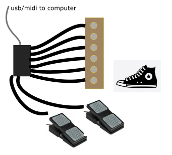
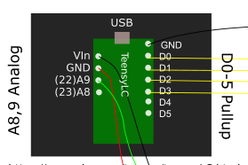
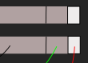
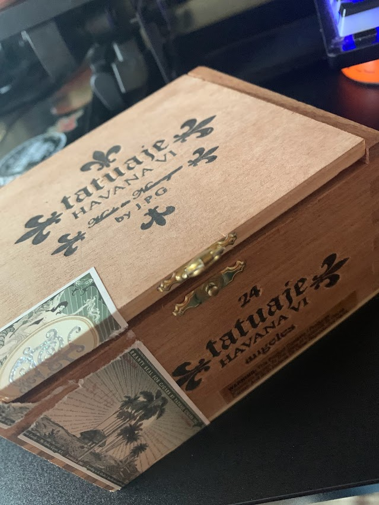
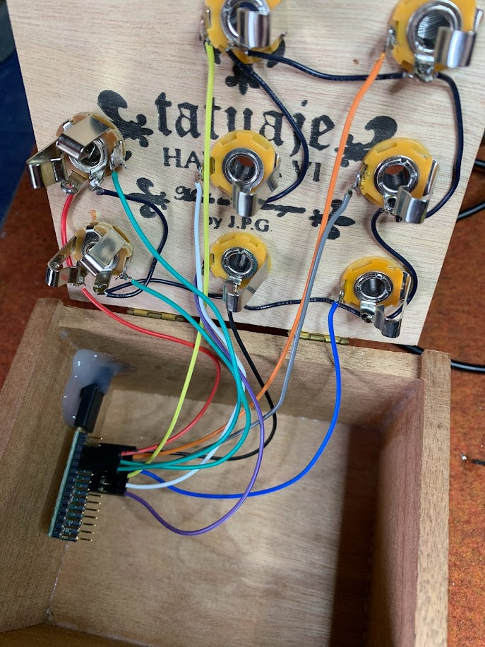
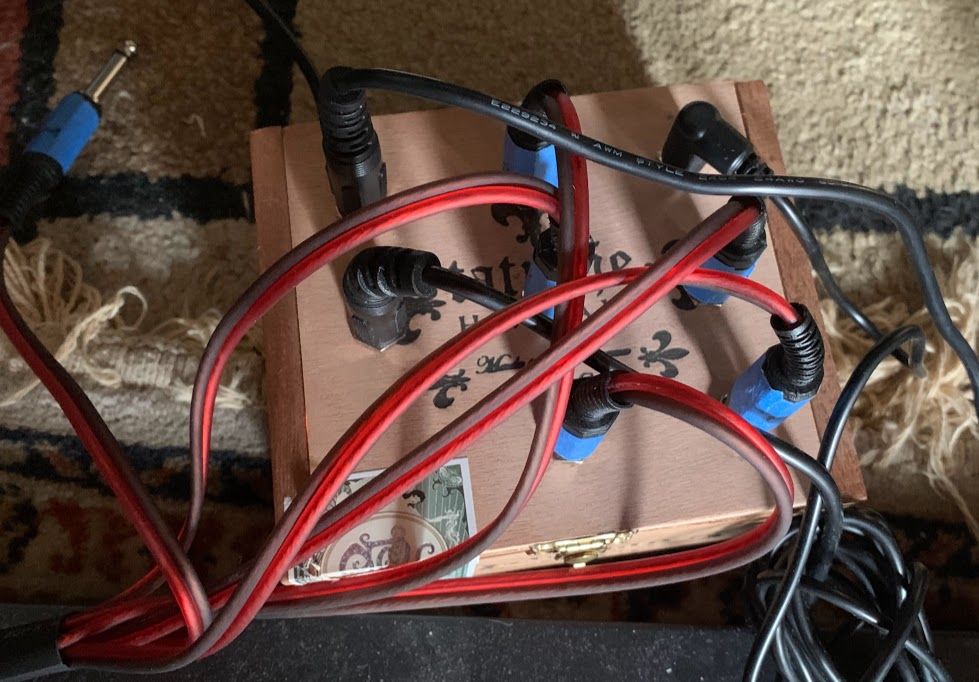
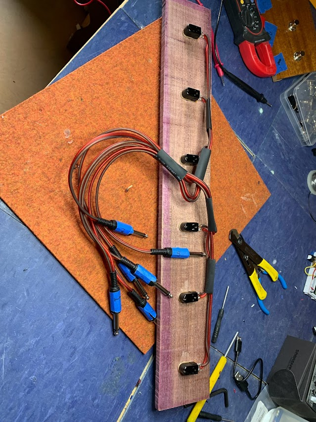
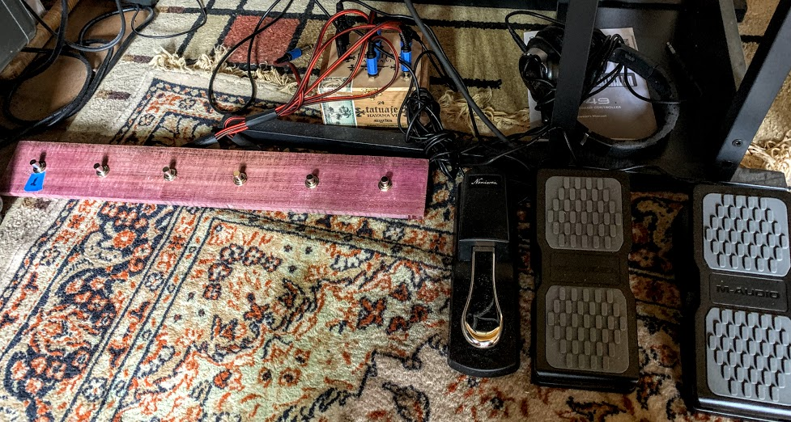

# dbStompbox

dbStompbox is a simple TeensyLC-based MIDI controller.

Stompboxes are useful for hands-free music-making. Combine a stompbox
with a looper and a guitar and magic musical moments (TM) are are
yours for the "picking".

dbStompbox was built as part of a tutorial of Fiddle's Looper capability.
Fiddle is a free and open music-making engine (DAW).  You can learn more
about Fiddle [here](https://cannerycoders.com/#Fiddle).

## The Prerequisites

* Familiarity with Arduino Development
* Handy with a Soldering Iron
* Musically Inclined

## The Hardware Design

It is amazingly simple to build your own custom MIDI controller.  Combine
any number of digital sensors with a Teensy and you are on your way. 

In this example, we support two expression pedals (for, eg Wah and Volume) 
with a number of foot-switches (for, eg multi-channel looper control)
to deliver hands-free control over a DAW for guitar players.

We house the Teensy and phone-socket connection points in a free-standing
cigar-box.  The sturdy wooden construction of these boxes makes it easy to 
mount hardware connection points.

As a separate "device", we house the 6 footswitches.  Each switch is
connected to the USB-MIDI box through its own phone jack and this allows us
to support off-the shelf MIDI sustain pedals in addition to our custom 
footboard.

| Part          | Count | Description              | Link                                              | Approximate Cost |
| :------------ | :---- | :----------------------- | :------------------------------------------------ | :--------------- |
| Teensy LC     | 1     | Microcontroller          | [pjrc](https://www.pjrc.com/teensy/teensyLC.html) | $15              |
| M-Audio EX-P  | 2     | Expression Pedal         | [Amazon](https://www.amazon.com/dp/B000NLRWEI)    | $30 ea           |
| TRS Sockets   | 2     | For expression pedals    | [Amazon](https://www.amazon.com/dp/B079K74SC4)    | $2.50 ea         |
| Phone Sockets | 6     | For external stopbox     | [Amazon](https://www.amazon.com/dp/B07FB944VD)    | $.75 ea          |
| Phone Jacks   | 6     | From footboard to Teensy | [Amazon](https://www.amazon.com/dp/B07JP82FFX)    | $1 ea            |
| Foot Switches | 6     | Momentary Foot Switches  | [Amazon](https://www.amazon.com/dp/B08TBTWDYV)    | $2 ea            |
| Footboard     | 1     | A piece of wood          |                                                   | $0 - $20            |

Since you are handy with a soldering iron we assume you already have a 
soldering iron, wire, wire-cutters, solder and a continuity checker. A glue-gun
is also very handy for securing wires in place.

Total cost without expression pedals is under $30 dollars. A bargain at twice
the price.

## Wiring

The Teensy wiring is trivial.  Each footswitch is a button that, when pressed,
completes a circuit. We've configured the software to operate a digital input
pin in pullup mode. This means that all buttons share one terminal that's 
connected to ground. Its other terminal is wired to a Teensy pin.  When you 
stomp a footswitch it causes the Teensy pin to "go to ground" and this triggers
the emission of a MIDI control signal.  Here pins D0-D5 are connected 
to your buttons.

Pins A8, A9 are used to sample the expression pedals.  Expression pedals
introduce a variable resister (potentiometer) between the reference voltage
and ground.  In the 3.3V TeensyLC, the reference signal is obtained from either
ARef or the 3.3V pin.  Here is a crude diagram representing the portion of
the TRS jack and its associated signal connections.  The green wire represents
the state of the expression pedal and is wired to the Teensy pin A8 or A9.

## To Build the Software

Load the `.ino` file into the [Teensyduino](https://www.pjrc.com/teensy/td_download.html) 
software.

Make sure to select Teensy LC as your board.

Select Serial+Midi as the USB Type.

Build and deploy.

## In Operation

When the project is deployed, the stompboard is functioning. The Teensy LED
blinks slowly to indicate all is alive and well. Plug the USB cable into 
your computuer. The new USB-MIDI device should appear in the MIDI input
registry under the name dbStompbox.

Here are the MIDI signals it emits:

|Name|Description|
|:---|:--        |
|CC8 Continuous Controller 1| Expression Pedal on Pin 22 (A9)|
|CC9 Continuous Controller 2| Expression Pedal on Pin 23 (A8)|
|CC64 | Footswitch 1 |
|CC65 | Footswitch 2 |
|CC66 | Footswitch 3 |
|CC67 | Footswitch 4 |
|CC68 | Footswitch 5 |
|CC69 | Footswitch 6 |

These values can easily be changed by modifying and redeploying the software.

If you find that your continuous controller doesn't capture the full range of
motion, you may need to tweak the logic in the software or remap the range
in your DAW. Different controllers have different variable resistor loads 
and "tapering".

## Photos

Here's the cigar box to house the TeensyLC:

Here's the Teensy wired and in place. The back, bottom-left
is the USB wire that powers and connects the Teensy to your
computer.  Phone jacks connect on the top of the box.

And now it's ready for action.  

Here's the footboard:

And the whole setup, complete with off-the-shelf expression pedals:

